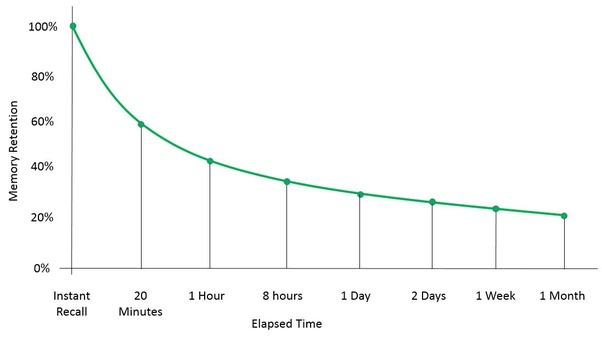
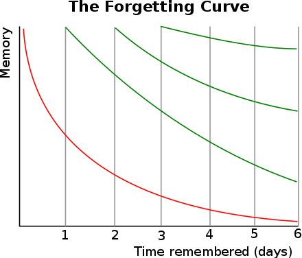

## Jeszcze raz witam!

The forgetting curve is a psychology concept, discovered by German Scientist [Hermann Ebbinghaus](https://www.britannica.com/biography/Hermann-Ebbinghaus), which describes how the brain’s ability to retain information decreases over time. The idea behind his extensive research is that memorized information is lost at an exponential rate, meaning that after a day or two, you have less than a 40% chance of recalling something you had previously memorized. This concept stresses the importance of reviewing information at regular intervals to reset the forgetting curve and developing new neural pathways, as we discussed in our earlier post. Here is a graphical representation of the forgetting curve:

Several other factors also contribute to how well we retain, or forget, information. Those factors include:

- How difficult is the learned material? How easy is it to connect to already developed neural pathways?
- Was the material introduced in a way that is easily digestable (does it fall into your preferred learning style?)
- What was your psychological state when you were studying? Were you stressed or tired?

## So how do you combat the forgetting curve?

Well another discovery by Hermann Ebbinghaus is called the spacing effect and it suggests reviewing information at strategic intervals to maximize your retention ability. For example, say you learn a new word or phrase in polish. Ideally, you want to review it within an hour, then again right after five hours, then again after a day, once more after three days, and so on until you have ten repetitions after about eight months. Each time you review the word or phrase, you are able to recall it after a longer period of time. Here is a graphical representation of the spacing effect:

These concepts are in fact so successful, there have been used in the development of several language acquisition applications. One of the most prominent is Memrise, which I also recommend if you're interested in supplementing our language learning applications with yet another mobile app.

The spacing effect works, not just for humans, but for all biological life forms. Additionally, this methodology can be applied to anything you want to learn, not just language acquisition.

What can you do to improve your memory?

1. First you can use a technique called memory hooks in which you create a more personal connection to the information by relating it to something you do know. Essentially you can build off your existing neural pathways by connecting new words and phrases to words and phrases you already know. For example for me I just learned the Polish word for eight which is osiem sounds like the english word awesome. So of course I can relate this too the phrase ‘Everything is osiem’ which is probably a stupid joke and not that funny but it’ll help me remember it in the future. (Read more on [memory hooks](https://roadtoepic.com/remember-anything-forever-with-memory-hooks/).)

2. Incorporate more senses. When studying, don’t just hear the word, select the option, and move on. Hear the word, repeat it! Sound it out, look at the spelling. Make the connection between the sounds and the letters. It’s a bit more difficult but it will help you in the long run.

3. Make it fun! Information is just never going to stick if you're bored and uninterested.

4. Don’t forget to review keeping, the forgetting curve and the spacing effect in mind! Learning a language requires retaining words and phrases for life!
